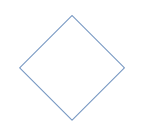

This project celebrates the wonderful patterns of the Alhambra. These patterns are calculated with JavaScript and drawn using SVG in the browser.

This was made possible by the analytical work of Manuel Martinez Vela. See his [YouTube channel](https://www.youtube.com/playlist?list=PLHG5uxhiqH9X3a2ryA4rtvRSP-6zDpsJY)

To draw a pattern we first need to calculate the points of the basic shapes. Then we copy, move and rotate these shapes, color them, and put them in their position. A shape is simply a polygon. Several shapes together form a pattern unit. The pattern itself is formed by filling up a space with pattern units.

## The "design" phase

In this phase we draw line pieces, circles, and squares to help us find coordinates. These elements are also drawn on the canvas so that we can visually inspect the work for errors. We calculate intersections between them to find the points of the basic shapes. The product of this phase is a basic set of named polygons. The coordinates of the points of the shapes lie in the range [0.0 ... 1.0, 0.0 ... 1.0].

In this phase we draw **figures** and we need to come up with names for different sorts of figures.

> When I use the word "line" I always mean "line piece".

The following figures are implicitly **primary**

-   A **line piece** is the piece of a line between points A and B
-   A **circle** is a circle with a center and a radius
-   A **square** is a square with horizontal and vertical line pieces
-   A **diamond** is a square on its side, but defined by its top, bottom, left and right

-   A **horizontal** is a horizontal line piece
-   A **vertical** is a vertical line piece
-   A **descender** is a diagonal from top left to bottom right
-   An **ascender** is a diagonal from bottom left to top right
-   A **plus** is formed by a vertical and a horizontal
-   An **ex** is formed by a descender and an ascender

When there are multiple nested squares and diamonds, these are numbered 1, 2, 3, ..., starting with the biggest one.

When two parallel figures (mostly lines) are needed in stead of one

-   A **secondary** figure is formed by 2 lines in each direction, close to the primary
-   A **tertiary** figure is formed by 2 lines in each direction, a bit farther away from the primary
-   A **quartiary** figure is formed by 2 lines in each direction, a bit farther away still from the primary

When multiple figured are returned by a function, they are ordered from left to right, them top to bottom.

## The drawing phase

When drawing the pattern units, they are colored, multiplied, rotated, and moved into place. The instances of the pattern units need not all look the same. The coloring of different units may be different, for example.

## Todo

What would be a good scale for the shapes? Currently the points take on pixel values. Works for now, but maybe not later.
